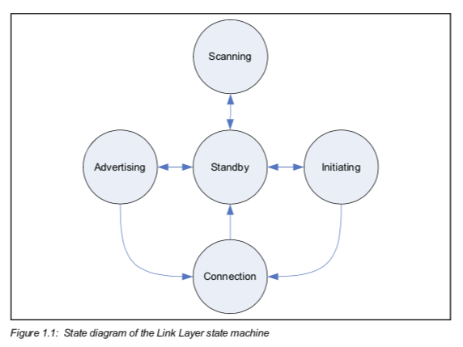
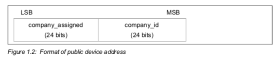
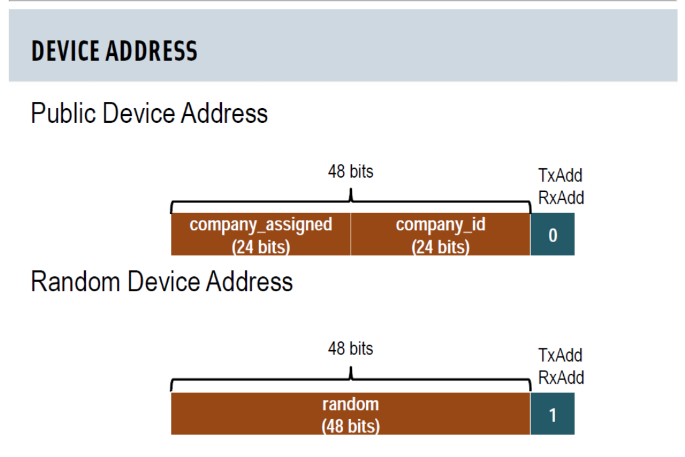
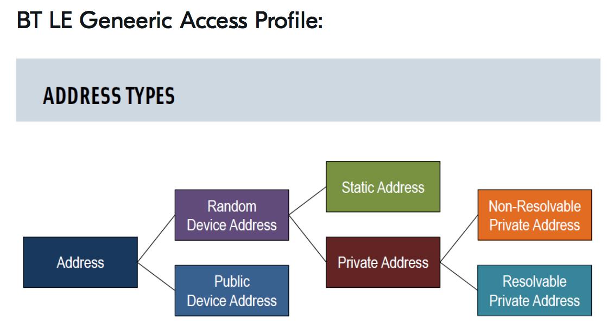
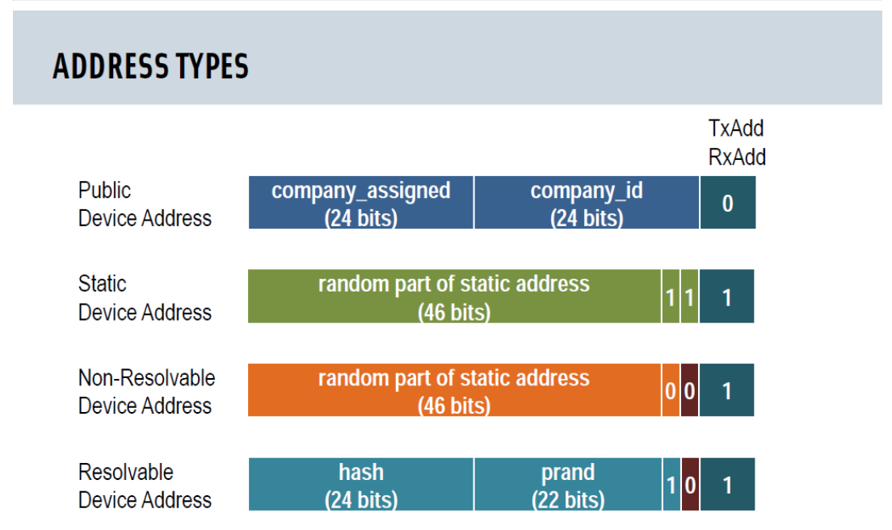
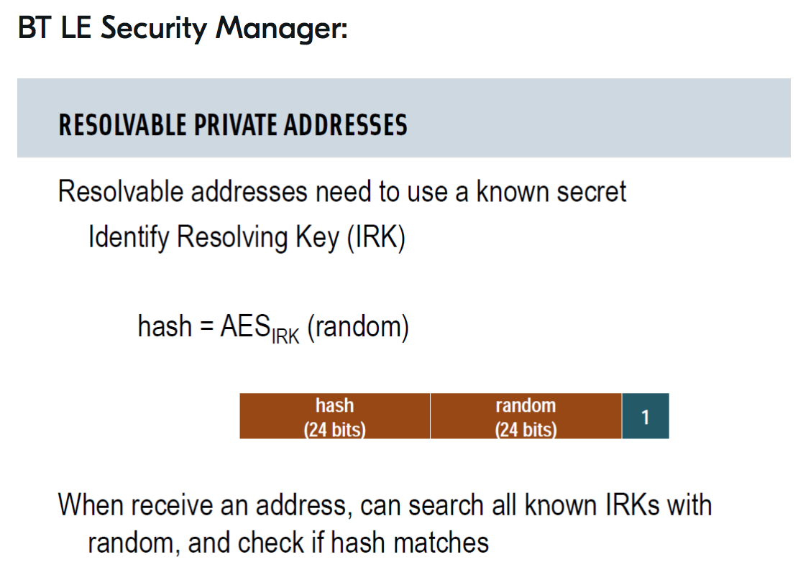
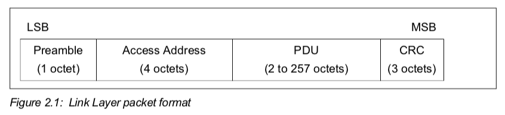
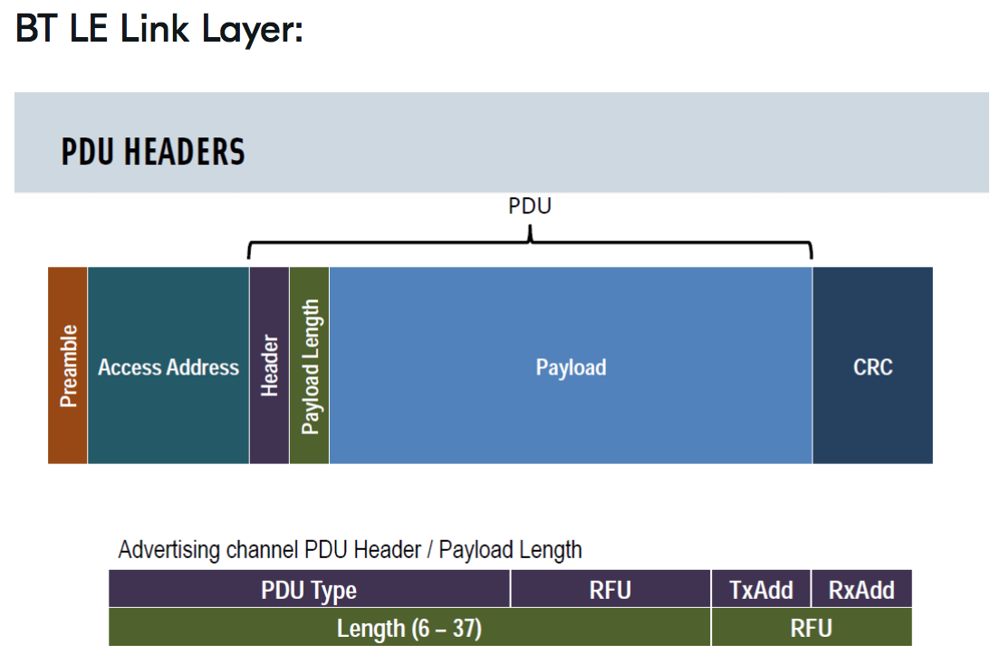
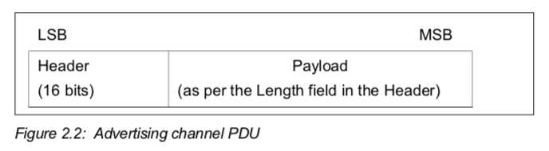
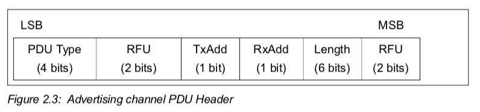

# Bluetooth & BlueZ
A collection of Bluetooth (and BLE) reading, tutorials, projects, tools, etc..


**Table of Contents**  

1. [Reading](#reading)
1. [Projects](#projects)
1. [Apps](#apps)
1. [Equipment](#equipment)
1. [Install](#intall)
1. [Dev/Test](#devtest)
1. [Dev/Test Workflow](#devtest-workflow)
1. [Getting Started: Bluetooth Tools & Commands](#tools-and-commands)
1. [Concepts & Definitions](#concepts-and-definitions)
1. [UUIDs](#uuids)
1. [BLE State Machines](#ble-state-machines)
1. [BLE Packets](#ble-packets)
1. [BLE Addresses](#ble-addresses)
1. [BLE Over-the-Air](#ble-ota)
1. [BLE Advertising](#ble-advertising)
1. [BLE Security](#ble-security)
1. [Glossary](#glossary)

<!-- NOTE: each item automatically numbered by its order in the list. -->

<div id='reading'/>
## Reading 

2018

- [BLE Advertising Primer](https://www.argenox.com/bluetooth-low-energy-ble-v4-0-development/library/a-ble-advertising-primer/) 
*(Includes a nice breakdown of Apple's iBeacon payload format - Included in Argenox's [BLE Library](https://www.argenox.com/library/bluetooth-low-energy/))*.

2017

- [Bluetooth Hacking Tools Comparison (2017)](https://duo.com/decipher/bluetooth-hacking-tools-comparison)
- [The Practical Guide to Hacking Bluetooth Low Energy](https://blog.attify.com/the-practical-guide-to-hacking-bluetooth-low-energy/) (2017?)

2016

- [Turning a Raspberry Pi 3 into a Bluetooth Low Energy peripheral (2016)](https://tobiastrumm.de/2016/10/04/turning-a-raspberry-pi-3-into-a-bluetooth-low-energy-peripheral/)
- [Understanding & Optimizing BLE Throughput (2016)](https://github.com/chrisc11/ble-guides/blob/master/ble-throughput.md)

2015

- [GATT Services and Characteristics - Chapter 4 of Getting Started with Bluetooth Low Energy by Davidson et al. (2015)](https://www.oreilly.com/library/view/getting-started-with/9781491900550/ch04.html)
- [Now I wanna sniff some Bluetooth: Sniffing and Cracking Bluetooth with the UbertoothOne](https://www.security-sleuth.com/sleuth-blog/2015/9/6/now-i-wanna-sniff-some-bluetooth-sniffing-and-cracking-bluetooth-with-the-ubertoothone)

2014

- [Introduction to Bluetooth Low Energy (2014)](https://learn.adafruit.com/introduction-to-bluetooth-low-energy/introduction)
- [Bluetooth Recon With BlueZ (2014)](https://blog.ice9.us/2014/02/bluetooth-recon-with-bluez.html)

Older

- [Bluetooth: ATT and GATT (2011)](https://epxx.co/artigos/bluetooth_gatt.html)
- [Linux BlueZ HOW TO (2001)](https://pub.tik.ee.ethz.ch/people/beutel/bluezhowto.pdf)
- [Interact with Bluetooth devices on the Web](https://developers.google.com/web/updates/2015/07/interact-with-ble-devices-on-the-web)

###### Tutorials/Working References

- [Blue Picking - Hacking Bluetooth Smart Locks (2017)](https://conference.hitb.org/hitbsecconf2017ams/materials/D2T3%20-%20Slawomir%20Jasek%20-%20Blue%20Picking%20-%20Hacking%20Bluetooth%20Smart%20Locks.pdf) *(Slides)* - Features tools & techniques: *BLE-Replay, GATTacker, MAC Address Spoofing*
- [BtleJuice: The Bluetooth Smart MitM Framework](https://speakerdeck.com/virtualabs/btlejuice-the-bluetooth-smart-mitm-framework?slide=12)
- [Bluetooth Class of Device (CoD) List in Binary & Hex](https://www.question-defense.com/tools/class-of-device-bluetooth-cod-list-in-binary-and-hex)

###### Bluetooth Specification

- [GATT Declarations](https://www.bluetooth.com/specifications/gatt/declarations/)
- [GATT Services](https://www.bluetooth.com/specifications/gatt/services/)
- [GATT Characteristics](https://www.bluetooth.com/specifications/gatt/characteristics/)
- [GATT Descriptors](https://www.bluetooth.com/specifications/gatt/descriptors/)
- [Company Identifiers](https://www.bluetooth.com/specifications/assigned-numbers/company-identifiers/)
- [Class of Device (CoD) / Baseband](https://www.bluetooth.com/specifications/assigned-numbers/baseband/)


<div id='projects'/>
## Projects (Mostly Linux)

###### Official Sources

**BlueZ:**

- BlueZ Source Tree: [https://git.kernel.org/pub/scm/bluetooth/bluez.git]()
- BlueZ Official Releases: [http://www.bluez.org]()

**BTstack:**

- Blue Kitchen's BTstack (lightweight BT stack for resource-constrained devices): [http://bluekitchen-gmbh.com/btstack/]()
	- [Protocols](http://bluekitchen-gmbh.com/btstack/protocols/)
	- [Profiles](http://bluekitchen-gmbh.com/btstack/profiles/)

###### Especially Useful for Research

My forks: 

- [**btsnoop**](https://github.com/traviswpeters/btsnoop)  - Parsing module for btsnoop packet capture files
- [**BluePy**](https://github.com/traviswpeters/bluepy) - Python interface to Bluetooth LE on Linux
- [**Armis - BlueBorne PoC Code**](https://github.com/traviswpeters/blueborne)

Replay tools, etc.:

- ==[**BLE-Replay**](https://github.com/nccgroup/BLE-Replay) - Parses hcidump to json, wraps into python BLE client for replay/fuzzing==
- ==[**BLESuite**](https://github.com/nccgroup/BLESuite) - Python package to make Bluetooth Low Energy (BLE) device communication more user friendly== 
- [**GATTacker**](https://github.com/securing/gattacker) ([http://gattack.io]()) - MitM, MAC Cloning, Dump/Replay, etc.
- [**BtleJuice**](https://github.com/DigitalSecurity/btlejuice) - Similar to GATTacker.

###### Other Bluetooth Tools

- [crackle](https://github.com/mikeryan/crackle/) - LE encryption exploit
*(exploits a flaw in the BLE pairing process that allows an attacker to guess or very quickly brute force the TK (Temporary Key) -> decrypted communications)* 
- [PyBT](https://github.com/mikeryan/PyBT) - Mike Ryan's Hackable Bluetooth Stack - kinda old though...
- [Adafruit BLE Sniffer (Python)](https://github.com/adafruit/Adafruit_BLESniffer_Python)
- [Ubertooth](https://github.com/greatscottgadgets/ubertooth)
- [bettercap](https://www.bettercap.org/installation/) (was "bleah"?)
- [Zephyr Bluetooth tools](https://docs.zephyrproject.org/latest/guides/bluetooth/bluetooth-tools.html)
- [Bluetooth Class of Device/Service Generator](http://bluetooth-pentest.narod.ru/software/bluetooth_class_of_device-service_generator.html)
- [Online UUID Generator](https://www.uuidgenerator.net) 


<div id='apps'/>
## Apps

*All (or at least most) of these can be found on the Google Play Store.*

###### Android Dev Apps

- Nordic Semiconductor's [nRF Connect for Mobile](https://play.google.com/store/apps/details?id=no.nordicsemi.android.mcp)
- Punch Through's [Light Blue Explorer](https://play.google.com/store/apps/details?id=com.punchthrough.lightblueexplorer)
- [BLE Peripheral Simulator](https://play.google.com/store/apps/details?id=io.github.webbluetoothcg.bletestperipheral)

###### Android SmartHealth Device Apps

- [Kardia](https://play.google.com/store/apps/details?id=com.alivecor.aliveecg)
- [Kinsa](https://play.google.com/store/apps/details?id=com.kinsa)
- [Omron TENS](https://play.google.com/store/apps/details?id=jp.co.omron.healthcare.tens)
- [OMRON HeartAdvisor](https://play.google.com/store/apps/details?id=com.omronhealthcare.heartadvisor)
- [OMRON connect US/CAN](https://play.google.com/store/apps/details?id=com.omronhealthcare.omronconnect)
- [iHealth MyVitals](https://play.google.com/store/apps/details?id=iHealthMyVitals.V2)

###### Android SmartHome Device Apps

- [Engbird](https://play.google.com/store/apps/details?id=com.inkbird.engbird)  
- [Awair](https://play.google.com/store/apps/details?id=co.bitfinder.awair)   
- [Schlage Home](https://play.google.com/store/apps/details?id=com.allegion.leopard)
- [August Home](https://play.google.com/store/apps/details?id=com.august.luna) 
- [(Amazon Alexa App)](https://play.google.com/store/apps/details?id=com.amazon.dee.app&rdid=com.amazon.dee.app)


<div id='equipment'/>
## Equipment

*Equipment to consider purchasing for research in the future?*

- [Nordic Semiconductor nRF51-DK](http://www.mouser.com/Search/ProductDetail.aspx?R=nRF51-DKvirtualkey57440000virtualkey949-NRF51-DK) - $40 
- [Ubertooth One](https://greatscottgadgets.com/ubertoothone/) - $120 
- [Beagle USB 12 Protocol Analyzer](https://www.totalphase.com/products/beagle-usb12/) - $400 
- [Small Bluetooth Adapters (Amazon)](https://www.amazon.com/s?k=bluetooth+dongle+linux&i=electronics&ref=nb_sb_noss_2) - \$5 - \$25 each
- [Parani-UD100 Bluetooth 4.0 Class1 USB Adapter, Exchangeable Antenna](http://www.senanetworks.com/ud100-g03.html?sc=14&category=3968) - $40 
- [Bluetooth accessories (e.g., antennas)](http://www.senanetworks.com/Home/sn-bluetooth-accessories/)
- [Ellisys Bluetooth Explorer All-in-One Bluetooth® Analysis System](https://www.ellisys.com/products/bex400/) - $17,500+


<div id='intall'/>
## Install

The easiest way to get started is to install the Linux Bluetooth stack (BlueZ):

```bash
sudo apt-get install bluez
```

Alternatively, you can install from source: 

Example instructions:
https://learn.adafruit.com/install-bluez-on-the-raspberry-pi/installation

*NOTE: You may need to update software versions.*

Install dependencies:

```bash
# Something not installed that you need? Try:
#   `apt-cache search KEYWORD`

sudo apt-get update
sudo apt-get -y install build-essential libusb-dev libdbus-1-dev libglib2.0-dev libudev-dev libical-dev libreadline-dev valgrind \
    libtool libelf-dev libdw-dev libjson-c-dev alsa-utils libasound2-dev libsbc-dev libsdl-dev libspeexdsp-dev libell-dev #  extras that I needed.......WTF bluez docs?!
sudo apt-get -y install python-dev python-pip python-dbus
sudo pip install pexpect
```

Get the `bluez` source code:

```bash
cd ~

#Get a specific version:
wget http://www.kernel.org/pub/linux/bluetooth/bluez-5.33.tar.gz
tar xvfz bluez-5.33.tar.gz # vs. tar xf bluez-5.33.tar.xz
cd bluez-5.33

#Get the official repo:
git clone git://git.kernel.org/pub/scm/bluetooth/bluez.git
cd bluez
```

`make` bluez w/ options for better hacking/dev:

```bash
# configure & build
/bootstrap-configure --disable-mesh --disable-btpclient && make
# Generally, you can run
#   ./bootstrap-configure
#    make
# The explicitly-disabled options were causing issues (re: embedded linux); I don't need them, so remove them!
#    --enable-mesh \
#   --enable-btpclient \
# NOTE: automatically enables all the features of interest
# NOTE: runs `./configure --enable-maintainer-mode` which removes need to use `make install` when testing `bluetoothd`

#(optional; run self-tests)
make check
```

Extra steps (not necessary; at this point you should have all the bluez software built)

```bash
#(optional; check installation)
make install DESTDIR=$PWD/x
find x
rm -rf x
#(optional; check distribution)
make distcheck
# install
sudo make install
# remove autogenerated files
make maintainer-clean
```

Some hacking options:

```bash
# Copy configuration file which specifies the required security policies
sudo cp ./src/bluetooth.conf /etc/dbus-1/system.d/

# Run daemon in foreground with debugging
sudo ./src/bluetoothd -n -d -f ./src/main.conf
```

```bash
systemctl status bluetooth      # check status
sudo systemctl start bluetooth  # start
sudo systemctl stop bluetooth   # stop

sudo systemctl enable bluetooth # enable bluez to run @ boot
sudo systemctl disable bluetooth
```

<div id='devtest'/>
## Dev/Test

When building and testing directly from the repository it is important to
have at least automake version 1.10 or later installed.

**bluez `bootstrap` script**  
The basic scripts that uses the
autotools scripts to create the needed files for building and installing.
It makes sure to call the right programs depending on the usage of shared or
static libraries or translations etc.

**bluez `bootstrap-configure` script**  
This program will make sure to properly clean the repository, call the "bootstrap" script
*and then call configure with proper settings for development.*
It will use the best options and pass them over to configure.
These options normally include the enabling the *maintainer mode* and the *debugging features*.

**bluez `configure` script**  
So while in a normal source project the call `./configure ...` is used to
configure the project with its settings like prefix and extra options. In
case of bare repositories call "./bootstrap-configure" and it will bootstrap
the repository and calls configure with all the correct options to make
development easier.

In case of preparing for a release with `make distcheck`, don't use
`bootstrap-configure` since it could export development specific settings.

<div id='devtest-workflow'/>
## Dev/Test Workflow

The normal steps to checkout, build and install such a repository is like this:

```bash
# Install necessary dev packages
sudo apt-get update
sudo apt-get install -y libusb-dev libdbus-1-dev libglib2.0-dev libudev-dev libical-dev libreadline-dev

# Checkout repository
git clone git://git.kernel.org/pub/scm/bluetooth/bluez.git
#vs. http://www.kernel.org/pub/linux/bluetooth/bluez-5.43.tar.xz
cd bluez

# Configure and build
./bootstrap-configure
make

# Run unit tests
make check

# Check installation
make install DESTDIR=$PWD/x
find x
rm -rf x

# Check distribution
make distcheck

# Final installation
sudo make install

# Remove autogenerated files
make maintainer-clean
```
Running from within the source code repository

```bash
# When using "./configure --enable-maintainer-mode" the automake scripts will
# use the plugins directly from within the repository. This removes the need
# to use "make install" when testing "bluetoothd". The "bootstrap-configure"
# automatically includes this option.

# Copy configuration file which specifies the required security policies
sudo cp ./src/bluetooth.conf /etc/dbus-1/system.d/

# Run daemon in foreground with debugging
sudo ./src/bluetoothd -n -d -f ./src/main.conf

# Run daemon with valgrind
#sudo valgrind --trace-children=yes --track-origins=yes --track-fds=yes \
#--show-possibly-lost=no --leak-check=full --suppressions=./tools/valgrind.supp \
#./src/bluetoothd -n -d -f ./src/main.conf
```

For production installations or distribution packaging it is important that
the "--enable-maintainer-mode" option is NOT used.

Note multiple arguments to `-d` can be specified, colon, comma or space
separated. The arguments are relative source code filenames for which
debugging output should be enabled; output shell-style globs are
accepted (e.g.: `plugins/*:src/main.c`).

<div id='tools-and-commands'/>
## Getting Started: Bluetooth Tools & Commands

### Stored Data on the Linux Bluetooth Host

[Where are bluetooth link keys stored in Ubuntu 14.10?](https://askubuntu.com/a/565977) 
*(you need root to read/write these files)*. 

```bash
# ADAPTER_ADDR is the address of your connected BT controller. 
# Within the directory are all of its known devices (e.g., REMOTE_DEVICE_ADDR/).

# - "info" contains keys, device metadata, etc. 
/var/lib/bluetooth/ADAPTER_ADDR/REMOTE_DEVICE_ADDR/info

# - "attributes" contains cached GATT service information.
/var/lib/bluetooth/ADAPTER_ADDR/REMOTE_DEVICE_ADDR/attributes
```

For example:

```
$ cat /var/lib/bluetooth/60\:03\:08\:8F\:51\:0F/FC\:18\:3C\:85\:88\:4F/info
[IdentityResolvingKey]
Key=XXXXXXXXXXXXXXXXXXXXXXXXXXXXXXXX (scrubbed)

[SlaveLongTermKey]
Key=XXXXXXXXXXXXXXXXXXXXXXXXXXXXXXXX (scrubbed)
Authenticated=2
EncSize=16
EDiv=0
Rand=0

[General]
Name=XXXXXXXXXXXXXXXXXXXXXXXXXXXXXXXX (scrubbed)
Appearance=0x0040
AddressType=public
SupportedTechnologies=BR/EDR;LE;
Trusted=false
Blocked=false
Services=00001800-0000-1000-8000-00805f9b34fb;00001801-0000-1000-8000-00805f9b34fb;00001805-0000-1000-8000-00805f9b34fb;0000180a-0000-1000-8000-00805f9b34fb;0000180f-0000-1000-8000-00805f9b34fb;7905f431-b5ce-4e99-a40f-4b1e122d00d0;89d3502b-0f36-433a-8ef4-c502ad55f8dc;9fa480e0-4967-4542-9390-d343dc5d04ae;d0611e78-bbb4-4591-a5f8-487910ae4366;

[ServiceChanged]
CCC_LE=2
```

### Research Tools/Commands

```
./bt --scan --connect
./bt --scan --knownonly
./bt --parse --all
```

### Quick Reference (Most Used Tools/Commands)

```bash
# start the bluetooth service + see which BT devices are available
systemctl start bluetooth.service && hcitool dev
```

```bash
# In case of problems connecting to the device, stop and restart the bluetooth service
sudo systemctl stop bluetooth
sudo systemctl start bluetooth
```

```bash
# Fetch HCI log file from Android device 
# Another possible location? `/storage/emulated/legacy/btsnoop_hci.log`
# => See also: https://developer.android.com/studio/command-line/adb
adb pull /sdcard/btsnoop_hci.log
```


#### hciconfig

A tool to configure Bluetooth devices (i.e., the local Bluetooth Controller). 

```bash
hciconfig hci0 down
hciconfig hci0 up
hciconfig hci0 reset
```

#### hcitool

A tool to configure Bluetooth connections. 

The `hcitool` enables software to interact with the Bluetooth Controller over the Host Controller Interface (HCI). For example, the `hcitool` can be used to initiate scanning for nearby Bluetooth devices, creating connections with devices, configuring aspects of how the Host's Controller operates, and so forth. 

```bash
hcitool -i hciX        # specify the HCI interface to use. 
hcitool dev            # show adapter/see availabel Bluetooth devices (controllers)

hcitool lescan         # scan for BLE devices
hcitool leinfo ADDR    # info about ble device
hcitool lecc ADDR      # connect to a BLE device

# Send HCI Command
# hcitool cmd <ogf> <ocf> <args>

hcitool cmd 0x03 0x000d 0x01   # Read Stored Link Key (are 1+ keys stored in controller?)
hcitool cmd 0x04 0x0001        # Read Local Version Information 
hcitool cmd 0x04 0x0009        # Read bd_addr
hcitool cmd 0x08 0x0003        # LE Read Local Supported Features
hcitool cmd 0x08 0x0005 ADDR   # LE Set Random Address
```


#### gatttool

A tool for Bluetooth Low Energy devices. 

For example, `gatttool` makes it easy to discover the services and characteristics on nearby BLE devices. Most noteably, gatttool enables an interactive mode, whereby a human user can use the commandline to connect with a BLE device and interact with it. 

```bash
# Launch gatttool in interactive mode
gatttool -I
	connect <addr> # connect to a device in interatie mode

# Create an interactive connection with a specific Bluetooth device
# One thing to note: if you're trying to connect to a device using a random address,
# such as the FitBit Flex, you need to add the -t random command line flag.

sudo gatttool -b <BLE ADDRESS> -t random -I # connect to a specific device
# Ex. -> gatttool -b AA:BF:34:C0:95:FF -t private -I

# ONCE CONNECTED:
    primary                         # Get the primary UUIDs
    characteristic                  # Check for available (readable) characteristics
    char-desc                       # Descriptor discovery; + get all the available handles?
    char-read-hnd <handle>          # Read characteristic by handle
    char-write-req <handle> <data>  # Write to characteristic by handle
```

#### btmon

The BlueZ Bluetooth monitor. 
`btmon` monitors all traffic over the HCI. 
Observed traffic can be written to a file and read back in (processed/displayed) later. 
Also, `btmon` can present a live view in the terminal. 

```bash
# bluez 5.X version of hcidump (better and more modern)
btmon [--time|--date] 

# On Kali, write btmon capture session to file; read back in; view in hex. 
btmon --write logs/testscan.log
btmon --read logs/testscan.log

# btmon can also give high-level stats (# commands, #events, controller ADDR, etc.)
btmon --analyze logs/testscan.log 

```

You can also look at the log file in a binary/head editor:

```bash
xxd logs/testscan.log
```

#### bluetoothctl

An interactive Bluetooth control tool. 

```bash
bluetoothctl
    power off
    power on
    agent on
    default-agent # used to ask for the pairing pin code
    scan on
    scan off
    info ADDR
    pair ADDR
    devices
    list-attributes ADDR
    select-attribute ATTR_PATH
        read
        attribute-info
        write 0x3 0x4 0x10 0x20 0x30 0x40
```

#### btmgmt

A command-line interface of BlueZ for management. 

```bash
btmgmt le on
btmgmt bredr off
```

#### sdptool

A tool to control and interrogate SDP servers.

```bash
# NOTE: sdptool works even when the target device is not discoverable!
sdptool browse BDADDR # browse services
sdptool records BDADDR # more detailed browsing info
```


#### Python Tools

```bash
# bluepy
python btle.py xx:xx:xx:xx:xx:xx random

# NOTE: bluepy depends on the `bluepy-helper`, which interacts with bluez. 
# To explore the features of the bluepy-helper directly, run the executable: 
./bluepy-helper 0
le on
scan
quit
```


<div id='concepts-and-definitions'/>
## Concepts & Definitions

### HCI - Host Controller Interface

The HCI protocol provides a command interface to the Bluetooth chipset.

It is common that the HCI implementation also keeps track of all active connections and handles the fragmentation and re-assembly of higher layer (L2CAP) packets.

### L2CAP - Logical Link Control and Adaptation Protocol

The L2CAP protocol supports higher level protocol multiplexing and packet fragmentation.

L2CAP is based around the concept of channels. A channel is a logical connection on top of a baseband connection. Each channel is bound to a single protocol in a many-to-one fashion. 


#### SDP - Service Discovery Protocol

The SDP protocol allows to announce services and discover services provided by a remote Bluetooth device.


### BNEP - Bluetooth Network Encapsulation Protocol

The BNEP protocol is used to transport control and data packets over standard network protocols such as TCP, IPv4 or IPv6. It is built on top of L2CAP.

#### SPP - Serial Port Profile

The SPP profile defines how to set up virtual serial ports and connect two Bluetooth enabled devices.

#### SMP - Security Manager Protocol

The SMP protocol allows to setup authenticated and encrypted LE connection.

The two main tasks of the SMP protocol are: **bonding** and **identity resolving**.

###### LE Legacy Pairing and LE Secure Connections

The original pairing algorithm introduced in Bluetooth Core V4.0 does not provide security in case of an attacker present during the initial pairing. To fix this, the Bluetooth Core V4.2 specification introduced the new LE Secure Connections method, while referring to the original method as LE Legacy Pairing.

LE Secure Connections are based on Elliptic Curve Diffie-Hellman (ECDH) algorithm for the key exchange. On start, a new public/private key pair is generated. During pairing, the Long Term Key (LTK) is generated based on the local keypair and the remote public key. 

###### Identity Resolving

Identity resolving is the process of matching a private, resolvable Bluetooth address to a previously paired device using its Identity Resolving (IR) key. 

To allow for later reconnection, the central and peripheral devices will exchange their Identity Resolving Keys (IRKs) during bonding. The IRK is used to verify if a new address belongs to a previously bonded device.

### Generic Access Profile (GAP)

The GAP profile defines how devices find each other and establish a secure connection for other profiles. 

GAP is responsible for the connections and advertising in BLE. 
GAP is responsible for the visibility of a device to the external world and 
also plays a major role in determining how the device interacts with other devices.
The following two concepts are integral to GAP:

- **Peripheral devices**: These are small and low energy devices that can connect with complex, more powerful central devices. A reart rate monitor is an example of a peripheral device.
- **Central devices**: These devices are mostly smartphones, tablets, PCs, and other devices that have increased memory and processing power.

There are four GAP roles defined for LE devices:

> **Broadcaster Role**  
A device operating in the Broadcaster role is a device that sends advertising events as described in [Vol. 6], Part B Section 4.4.2. A device operating in the Broadcaster role is referred to as a Broadcaster and shall have a transmitter and may have a receiver.

> **Observer Role**  
A device operating in the Observer role is a device that receives advertising events as described in [Vol. 6], Part B Section 4.4.3. A device operating in the Observer role is referred to as an Observer and shall have a receiver and may have a transmitter.

> **Peripheral Role**  
Any device that accepts the establishment of an LE physical link using any of the connection establishment procedures as defined in Section 9 is referred to as being in the Peripheral role. A device operating in the Peripheral role will be in the Slave role in the Link Layer Connection State as described in [Vol. 6], Part B Section 4.5. A device operating in the Peripheral role is referred to as a Peripheral. A Peripheral shall have both a transmitter and a receiver.

> **Central Role**  
A device that supports the Central role initiates the establishment of a physical connection. A device operating in the Central role will be in the Master role in the Link Layer Connection State as described in [Vol. 6], Part B Section 4.5. A device operating in the Central role is referred to as a Central. A Central shall have both a transmitter and a receiver.

###### Pairing

By default, Bluetooth communication is not authenticated, and any device can talk to any other device. A Bluetooth device (for example, cellular phone) may choose to require authentication to provide a particular service (for example, a Dial-Up service). The process of establishing authentication is called pairing. Bluetooth provides two mechanism for this.

On Bluetooth devices that conform to the Bluetooth v2.0 or older specification, a PIN code (up to 16 bytes ASCII) has to be entered on both sides.

The Bluetooth v2.1 specification introduces Secure Simple Pairing (SSP). With SSP, the devices first exchange their IO Capabilities and then settle on one of several ways to verify that the pairing is legitimate.

Regardless of the authentication mechanism (PIN/SSP), on success, both devices will generate a link key. The link key can be stored either in the Bluetooth module itself or in a persistent storage. The next time the device connects and requests an authenticated connection, both devices can use the previously generated link key. Please note that the pairing must be repeated if the link key is lost by one device.

###### Bonding

The purpose of bonding is to create a relation between two Bluetooth devices based on a common link key (a bond). The link key is created and exchanged (**pairing**) during the bonding procedure and is expected to be stored by both Bluetooth devices, to be used for future authentication. In addition to pairing, the **bonding** procedure can involve higher-layer initialization procedures.

> **General Bonding** refers to the process of performing bonding during connection setup or channel establishment procedures as a precursor to accessing a service.

> **Dedicated Bonding** refers to a procedure wherein one device connects to another only for the purpose of pairing without accessing a particular service. The main difference with dedicated bonding, as compared to a pairing done during link or channel establishment, is that for bonding it is the paging device (A) that must initiate the authentication.

### ATT & GATT

Here is an illustration of the relationship between services, characteristics, descriptors, properties, and values, all of which are built atop ATT and GATT. 
These terms are defined and discussed below. 
This figure is presented here as a reference. 

 

ATT is a wire application protocol, while GATT dictates how ATT is employed in service composition.

Every Low Energy profile must be based on GATT.

Therefore, ultimately, every LE service uses ATT as the application protocol.

###### ATT

The sole building block of ATT is the **attribute**.
An attribute is composed by three elements:

- a 16-bit **handle** *(just a number that uniquely identifies an attribute, since there may be many attributes with the same UUID within a device)*;
- a **UUID** which defines the attribute **type** *(ATT itself does not define any UUID. This is left to GATT and higher-level profiles.)*;
- a **value** of a certain **length** *(From the point of view of ATT, value is amorphous, it is an array of bytes of any size. The actual meaning of the value depends entirely on UUID, and ATT does not check if the value length is consistent with a given UUID etc.)*.

The **Attribute Protocol (ATT)** is a simple client/server stateless protocol based on attributes presented by a device. 
In BLE, each device is a client, a server, or both, irrespective of whether it’s a master or slave. 
A client requests data from a server, and a server sends data to clients. 
The protocol is strict when it comes to its sequencing: if a request is still pending 
(no response for it has been yet received) 
no further requests can be sent until the response is received and processed. 
This applies to both directions independently in the case where two peers are acting both as a client and server. 


An **ATT server** stores attributes.
An **ATT client** stores nothing; it uses the ATT wire protocol to read and write values on server attributes.
*Indeed, most of the ATT protocol is pure client-server: client takes the initiative, server answers.*
But ATT supports **notification** and **indication** capabilities, in which the server takes the initiative of notifying a client that an attribute value has changed, saving the client from having to poll the attribute.

ATT is very, *very* generic, and would leave too much for higher-level profiles to define.
Apart from the excess of freedom, there are some open issues, like: 
> **What if a device offers multiple services?**  

There is just one ATT handle space for each device, and multiple services must share the space in a cooperative way.
Fortunately, we have GATT, which shapes and delimits usage of attributes.

###### GATT

The **Generic Attribute Profile (GATT)** builds on the Attribute Protocol (ATT) 
and adds a hierarchy and data abstraction model on top of it. 
GATT is a base profile for ***all*** top-level LE profiles.
It defines how a bunch of ATT attributes are grouped together into meaningful services.

> In a way, it can be considered the backbone of BLE data transfer because it defines how data is organized and exchanged between applications. 

It defines generic data objects that can be used and reused by a variety of application profiles (known as GATT-based profiles ). It maintains the same client/server architecture present in ATT, but the data is now encapsulated in services , which consist of one or more characteristics . Each characteristic can be thought of as the union of a piece of user data along with metadata (descriptive information about that value such as properties, user-visible name, units, and more). 


> The cornerstone of a GATT service is the attribute with UUID equal to `0x2800` (which defines "primary services").

(There are secondary services, too (UUID `0x2801`), which are meant to be included by primary services.)
All attributes following this belong to that service, until another attribute `0x2800` is found.

Each attribute does not "know" by itself to which service it belongs.
GATT needs to figure it out based on handle ranges, and ranges are discovered solely on basis of UUID `0x2800` "cornerstones".

So, **each service definition attribute** has actually ***two UUIDs*** in its body: `0x2800` or `0x2801` as attribute UUID,
and another one stored in value, which specifies the service.

This sounds a bit confusing at first; two UUIDs to define a single service?
It is a result of layered GATT/ATT approach. 

> The UUID `0x2800`, which is well-known by GATT, is used to search for service boundaries.
Once they are found, the attributes are read and the second UUID (stored as value) specifies the service.
So a client may find all GATT services without knowing the specifics of e.g. a thermometer service.

###### Other Notes on ATT & GATT

***...some of which might be useful for parsing, modeling, etc.:***  

- There are fewer ATT/GATT implementations out there, which means less problems with suboptimal implementations and the accompanying interoperability issues (**bad software stacks plague Bluetooth Classic to this day**).
- There may be profiles for which ATT/GATT is not ideal as the application protocol.
**But there can always be a second L2CAP connection in parallel with ATT channel**, 
which in turn implements a profile-specific protocol.
- **Handle numbers are expected to be stable for each given device.** This allows clients to cache information, using less packets (and less energy) to retrieve attribute values after a first discovery. **Higher-level profiles specify how to "hint" a client that a server has changed attribute layout (e.g. after a firmware upgrade).**
	- ==Future Work: One concern in our work has been the question: how can models adapt over time to account for firmware upgrades, etc. The abilitity for an ATT server to inform an ATT client that handles have changed, etc. may be one approach. This should be done with caution, however, as an adversary may use this feature to maliciously adapt our models to avoid detection of malicious behavior.==
- The wire protocol **never sends value length**; **it is always implied from PDU size**, 
**and a client is expected to "know" the exact value layout for the UUID types it understands.**
Not sending value length explicitly saves bytes, which is particularly important in Low Energy, since MTU (maximum transmission unit) in LE is just 23 bytes.
	- ==Future Work: our passive monitor can enable "learning" insightful details about vendor-specific values.== 
- The small LE MTU is a problem for large attribute values. For those, ATT has "read long" and "write long" operations, which transfer big attributes in chunks.
	- ==Future Work: Long reads and writes (vs. normal reads and writes) may be another interesting feature.==
- **The ATT protocol is used for everything: discovering services, finding services' characteristics, reading/writing values, and so on.**
- **A typical BLE connection/intereaction sequence is**: (1) server (e.g., peripheral) advertises; (2) client (e.g., central) connects; (3) server notifies client when new data is available.
    - Once a connection is created, GATT communication can flow and notifications/indications can be delivered.
    - Once connected, **either side can establish a timeout for disconnection if no more notifications are received.**
The "best" timeout depends on the use case; 
**a service with infrequent notifications and no real-time pretensions may just disconnect immediately to save energy.**
Since BLE advertisement/reconnection mechanism is very fast — a major improvement from classic Bluetooth; 
**it is common/expected that most profiles will use a very short timeout or none at all.**
		- ==Future Work: Disconnection timeouts, which are application-specific, may be another interesting feature.==

### Services

A service is nothing more than a group of conceptually-related attributes in one common section of the attribute information set in the GATT server.

### Characteristics

The main characteristic attribute has UUID = `0x2803`.
As happens with services, this attribute has "double UUIDs": 
the generic one (`0x2803`) which allows for easy discovering,
and a more specific one which tells exactly which information the characteristic contains.

Each characteristic has at least two attributes:
***the main attribute (0x2803) and a value attribute that actually contains the value.***

The main attribute "knows" the value attribute's handle and UUID.
This allows for a certain degree of cross-checking.
The actual value format is entirely defined by its UUID.
So, if the client knows how to interpret the value UUID `0x2A08`, 
it is capable of reading date and time from any service that contains such a characteristic.
On the other hand, if the client does not know how to interpret a certain value UUID, it may safely ignore it.

### Descriptor

Apart from value, it is possible to have more attributes defined within a characteristic, if we need them.
In GATT lingo, those extra attributes are called **descriptors**.

Each service may define its own descriptors, but GATT defines a set of standard descriptors that cover most cases, for example:
- Numeric format and presentation;
- Human-readable description;
- Valid range;
- Extended properties;
and so on.

One particularly important descriptor is the client characteristic configuration.

### Client Characteristic Configurations Descriptor (CCCD): `ATT Write Request` & `ATT Write Response`

This descriptor, whose UUID is 0x2902, has a read/write 16-bit value, which is meant to be a bitmap.
The first two bits of CCC are already taken by GATT specification.
They configure characteristic notification and indication.
The other bits might be used for other functions, but they are currently reserved.

Effectively, the first two bits act as a switch, enabling or disabling server-initiated updates; only for the characteristic in which this CCCD is encapsulated within.
A CCCD is nothing more than a 2-bit bitfield, with on bit corresponding to **notifications** and the other to **indications**.
A client can set/clear these bits at anytime (the server checks these bits whenever the relevant characteristic value changes).

To enable notifications or indications for characteristics that supports them, use `ATT Write Request` packet to set the corresponding bit to 1.
The server will reply with `ATT Write Response` packet and start sending the appropriate packets whenever it wants to alert the client of a change in value.

NOTEs:
- CCCD values are unique per connection (i.e., each connected client can set/clear their own set of CCCD bits).
- CCCD values are preserved across connections with bonded devices (i.e., the last value written is guaranteed to be restored upon reconnection, regardless of the time elapsed between connections).

***NOTE:***
GATT knows that CCC belongs to a particular characteristic because its handle falls into the range between one characteristic and the next.
And it knows it is CCCD because of the distinctive UUID (0x2902).


<div id='uuids'/>
## UUIDs

A universally unique identifier (UUID) is a 128-bit (16 bytes) number that is guaranteed (or has a high probability) to be globally unique.
For example:

```
75BEB663-74FC-4871-9737-AD184157450E
```

It's typical to arrange the UUID in the format above (4-2-2-2-6).
Each pair of characters actually indicate a hexadecimal number. (So the 75 above is actually 0x75.)

To avoid constantly transmitting 16 bytes which can be wasteful
(Bluetooth is very limited in the amount of data and 16 bytes are significant),
the Bluetooth SIG has adopted a **standard UUID base**/**Bluetooth Base UUID**.
This base forms the first 96 bits (12 bytes)  of the 128-bit UUID. The rest of the bits are defined by the Bluetooth SIG:

```
XXXXXXXX-0000-1000-8000-00805F9B34FB
```

The remaining 32-bits are up to you.

In general, to reconstruct the full 128-bit UUID from the shortened version,
insert the 16-or 32-bit short value (indicated by XXXXXXXX  including leading zeros) into the Bluetooth Base UUID.

For instance, for 16-bit UUIDs, the bottom 16-bits remain 0.
For example the short form 16-bit UUID for the Heart Rate Service is:

```
0x180D
```

In reality this represents a 128-bit UUID:

```
0000[180D]-0000-1000-8000-00805F9B34FB
```
*(The `[...]` around the 16-bits --- aka 2 bytes --- was added for clarity.)*

Thus, if you're using existing services or profiles that were specified by the Bluetooth SIG, you can avoid using the full 128-bit UUID.
**Custom services, however, need a fully defined 128-bit UUID.**


#### UUIDs You Should Know

```
UUID_primary_service (0x2800)  # denotes the start of a new service
UUID_characteristic (0x2803)   # denotes the start of a characteristic (encapsulated within a service)
UUID_cccd (0x2902)             # denotes the special Client Characteristic Configuration Descriptor
```

**Service UUIDs**

```
0x1800 # Generic Access - generic infomration about the device; all characteristics are read-only
       # > Characteristics: Device Name, Appearance

0x1801 # Generic Attribute 
       # > Characteristics: Service Changed [Indicate ONLY], CCCD [RW]  

0x180A # Device Information
```

**UUIDs specifically related to the Heart Rate Service:**

```
UUID_hr_service (0x0x180D)
UUID_hr_measurement (0x2A37)
```

Example GATT Service (Heart Rate Service) w/ UUIDs:


<div id='ble-state-machines'/>
## BLE State Machines

BLUETOOTH SPECIFICATION Version 4.2 [Vol 6, Part B] page 30

Link Layer State Machine & State Machine States:



- **Standby**–device does not transmit or receive any packets.
- **Advertising**–a device will transmit packets on advertising channels and possible listen for (and respond to) responses triggered by advertishing channel packets. 
- **Scanning**–a device will listen on advertising channels for advertising packets.
- **Initiating**–a device will listen for advertishing channel packets from a specific device(s) and respond to these packets to initiate a connection with another device. 
- **Connection**–the connection state is entered from either the initiating state or the advertising state; a device in this state is known as being in a connection. 

***Within the Connection State, two roles are defined:***

- **Master Role**–assumed when a device enters a connection from the initiating state. The Link Layer in the Master Role will communicate with a device in the Slave Role and defines the timings of transmissions.
- **Slave Role**–assumed when a device enters a connection from the advertising state. The Link Layer in the Slave Role will communicate with a single device in the Master Role.

> The Link Layer may optionally support multiple state machines. 

> For instance, the Link Layer in the Connection State may operate in the Master Role and Slave Role at the same time.

> The Link Layer in the Connection State shall have at most one connection to another Link Layer in the Connection State.


<div id='ble-packets'/>
## BLE Packets

BLUETOOTH SPECIFICATION Version 4.2 [Vol 6, Part B] page 32

> The **bit ordering** when defining fields within the packet or Protocol Data Unit (PDU) in the Link Layer specification follows the **Little Endian** format. The following rules apply:
> 
> - The Least Significant Bit (LSB) corresponds to $b0$
> - The LSB is the first bit sent over the air.
> - In illustrations, **the LSB is shown on the left side**.
>
> Furthermore, data fields defined in the Link Layer, such as the PDU header fields, shall be transmitted with the LSB first. For instance, a 3-bit parameter X=3 is sent as:
>
> 	$b0b1b2$ = 110
>
> Over the air, 1 is sent first, 1 is sent next, and 0 is sent last. This is shown as 110 in the specification.
> Binary field values specified in this specification that follow the format 10101010b (e.g., pre-amble in Section 2.1.1 or advertising channel Access Address in Section 2.1.2) are written with the MSB to the left.


<div id='ble-addresses'/>
## BLE Addresses

BLUETOOTH SPECIFICATION Version 4.2 [Vol 6, Part B] page 33

[Sanitized IEEE OUI Data (oui.txt)](https://linuxnet.ca/ieee/oui/)

> Devices are identified using a device address. Device addresses may be either a **public** device address or a **random** device address. A public device address and a random device address are both **48 bits in length**.

> If a device is using **Resolvable Private Addresses**, it shall also have an Identity Address that is either a Public Device Address or Random Static Device Address type.

<!---->






The random device address may be of either of the following two sub-types:

- Static address
- Private address

These addresses are 48-bits randomly-generated bits, with the exception of the 2 most significant bits.

#### Private Device Address Generation

```
LSB             MSB
---------------- 11 static device address
---------------- 00 non-resolvable address
--hash---prand-- 10 resolvable private address
```

The resolvable private address is the most interesting type.
`prand` is 24-bits and includes the two most significant bits. 
Within `prand`, the two MSBs must be `10`. 
The remaining (22) bits of `prand` cannot be all 0 or all 1. 
`hash` is also 24-bits, and is generated using the random address function, $ah(k,r)$ 
(defined in [Vol 3] Part H, Section 2.2.2), 
where $k$ is set to the (Local/Peer) Identity Resolving Key (IRK) and $r$ is set to the value of `prand`:

> $hash = ah(IRK, prand)$

The `prand` and `hash` are concatenated to generate the random address (randomAddress) in the following manner:

> $randomAddress = hash || prand$

The least significant octet of `hash` becomes the least significant octet of randomAddress and the most significant octet of `prand` becomes the most significant octet of randomAddress.

#### Private Device Address Resolution

To resolve a private address, the resolver must hold a copy of the (previously-established) IRK. 
The resolution uses the same random address function as above, 
where IRK is the previously-established IRK, and `prand` is extracted from the observed resolvable private address. 

> $localHash = ah(IRK, prand)$

`localHash` is then compared with the `hash` value extract from the resolvable private address. 
If `localHash` and `hash` match, then the address has been resolved. 

Also note:

> If a device has more than one stored IRK, the device repeats the above procedure for each stored IRK to determine if the received resolvable private address is associated with a stored IRK, until either address resolution is successful for one of the IRKs or all have been tried.

> A non-resolvable private address cannot be resolved.


<div id='ble-ota'/>
## BLE Over The Air (OTA) Details 

> The preamble is 1 octet and the Access Address is 4 octets. The PDU range is from 2 to 257 octets. The CRC is 3 octets.




#### Access Address

> The Access Address for all **advertising channel packets** shall be `10001110100010011011111011010110b` (`0x8E89BED6`).

> The Access Address in data channel packets shall be different for each Link Layer connection between any two devices with certain restrictions as defined below. The Access Address shall be a random 32-bit value, generated by the device in the Initiating State and sent in a connection request as defined in Section 2.3.3.1.

#### PDUs

> When a packet is transmitted in an advertising physical channel, the PDU shall be the Advertising Channel PDU as defined in Section 2.3. When a packet is transmitted in a data physical channel, the PDU shall be the Data Channel PDU as defined in Section 2.4.

> The advertising channel PDU has a 16-bit header and a variable size payload. Its format is as shown in Figure 2.2. 



> The 16 bit Header field of the advertising channel PDU is as shown in Figure 2.3.



**TxAdd** = Transmitter Address bit (0 => transmitter's address is public; 1 => transmitter's address is private).

The PDU Type field of the advertising channel PDU that is contained in the header indicates the PDU type as defined below.

```
PDU Type 
b3b2b1b0	Packet Name
0000		ADV_IND
0001		ADV_DIRECT_IND
0010		ADV_NONCONN_IND
0011		SCAN_REQ
0100		SCAN_RSP
0101		CONNECT_REQ
0110		ADV_SCAN_IND
0111-1111	Reserved
```

#### CRC

> At the end of every Link Layer packet there is a 24-bit CRC. It shall be calculated over the PDU.

<div id='ble-advertising'/>
## BLE Advertising

When a BLE peripheral device is in advertising mode, advertising packets are sent periodically on each advertising channel.
The time interval between packet set has both a fixed interval and a random delay.
The interval is specified between the set of 3 packets (and 3 channels are almost always used).

You can set the fixed interval from 20ms to 10.24 seconds, in steps of 0.625ms.
The random delay is a pseudo-random value from 0ms to 10ms that is automatically added.
This randomness helps reduce the possibility of collisions between advertisements of different devices
(if they fell in the same rate, they could interfere more easily).

Despite the wide range supported for the advertising interval, most products use the following as a guideline:
- Less than 100ms - for very aggressive connections and usually for short periods of time
- 100ms to 500ms - normal fast advertising for most devices
- 1000ms to 2000ms for devices that connect to gateways and where latency is not critical

Most devices actually create a more complex system for advertising, using a Fast and Slow advertising regimes.
The device boots up or is told to start advertising at a fast rate because the user has interacted with it.
This is done for a limited amount of time to provide fast response when the user is expecting a quick connection.
After some pre-determined time, when no connection has occurred,
the device then switches to a slow advertising rate which allows an app to connect,
but limits the power consumption since the user may take some time to connect.

##### BLE Advertising Packets

- The Packet data unit for the advertising channel (called the **Advertising Channel PDU**) includes a 2-byte header and a variable payload from 6 to 37 bytes. The actual length of the payload is defined by the 6-bit Length field in the header of the Advertising Channel PDU.
- **ADV\_IND** is a generic advertisement and usually the most common. It’s generic in that it is not directed and it is connectable, meaning that a central device can connect to the peripheral that is advertising, and it is not directed towards a particular Central device. When a peripheral device sends an ADV_IND advertisements, it is helping Central devices such as Smartphones find it. Once found, a Central device can begin the connection process.
- **ADV\_NONCONN\_IND** is the advertisement type used when the peripheral does not want to accept connections, which is typical in Beacons.

```
ADV_IND: connectable undirected advertising event
ADV_DIRECT_IND: connectable directed advertising event
ADV_NONCONN_IND: non-connectable undirected advertising event
ADV_SCAN_IND: scannable undirected advertising event
```


<div id='ble-security'/>
## BLE Security

Let us have a look at the three main vulnerabilities that BLE may expose its users to:

> **Eavesdropping**: As the name suggests, eavesdropping refers to a third party device listening in on the data that’s being exchanged between two paired devices. A connection between two paired devices signifies a chain of trust. The chain gets broken when one of the device is removed. An attacker may use the device unit number for getting access to other Bluetooth connected devices. Even if the encryption/ decryption keys on the device were to be deleted, the attacker may brute force the PIN number offline using a Bluetooth Sniffer (using the ID of the device). Once the PIN is derived, the device can easily be hijacked.

> **Man in the Middle Attacks (MITM)**: Man in the middle attacks involve a third party device impersonating a legitimate device, tricking two legitimate devices into believing that they’re connected to each other, when in reality, the legitimate devices are connected to the impersonator. This sort of an attack enables the attacker/impersonator to access all the data that is being exchanged between the devices and also, manipulate data by deleting it or changing it, before it reaches the respective device.

> **Denial of Service & Fuzzing Attack**: Since most wireless devices these days work on inbuilt battery packs, these devices run the risk of being exposed to Denial of Service Attacks (DoS). DoS attacks expose a system to the possibility of frequent crashes leading to a complete exhaustion of its battery. Fuzzing attacks too lead to systems crashing as an attacker may send malformed or non-standard data to a device’s Bluetooth radio and check its response, ultimately overwhelming it.

### BLE Security Procedures

- **Pairing**—The procedure by which a temporary common security encryption key is generated to be able to switch to a secure, encrypted link. This temporary key is not stored and is therefore not reusable in subsequent connections. 

- **Bonding**—A sequence of pairing followed by the generation and exchange of permanent security keys, destined to be stored in nonvolatile memory and therefore creating a permanent bond between two devices, which will allow them to quickly set up a secure link in subsequent connections without having to perform a bonding procedure again. 

- **Encryption**—Re-establishment After a bonding procedure is complete, keys might have been stored on both sides of the connection. If encryption keys have been stored, this procedure defines how to use those keys in subsequent connections to re-establish a secure, encrypted connection without having to go through the pairing (or bonding) procedure again. 

### BLE Security Mechanisms 

- **Encryption**—This mechanism consists of the full encryption of all packets transmitted over an established connection. 

- **Privacy**—The privacy feature allows an advertiser to hide its public Bluetooth address by using temporary, randomly generated addresses that can be recognized by a scanner that is bonded with the advertising device. 

- **Signing**—With this mechanism, a device can send an unencrypted packet over an established connection that is digitally signed (i.e., the source of which can be verfied). 

> **Note:** ==Existing BLE security does not address the issues we raise in our work. For instance, when two devices A and B have previously bonded, and therefore have a pre-existing trust-relationship, the BLE Encryption feature does not protect the confidentiality of data sent between A and B. Similar arguments can be made for the BLE Privacy and BLE Signing features. Our work aims to enhance to awareness of trustworthiness between two or more devices that interact.== 

### BLE Security Keys

- **Long Term Key (LTK)** and **Master Identification Information (EDIV, Rand)** => Used for Encryption.

- **Identity Resolving Key (IRK)** and **Identity Address Information (Address Type, Bluetooth Device Address)** => Used for Privacy.

- **Connection Signature Resolving Key (CSRK)** => Used for Signing. 

> Each of these keys or key sets is asymmetrical and unidirectional: it can be used only in the same role configuration in which they were originally generated. If the devices wish to switch Link Layer roles (master and slave) in subsequent connections, then each side must distribute its own set of keys for each key type. Devices negotiate the number of keys distributed in each direction, which can range from zero to all three key types in each direction, for a total of six keys distributed between peers (three from slave to master and three from master to slave). 

### BLE Security Modes

*Specifically with respect to the Generic Access Profile.*


> **Security mode 1 (non-secure)**  
When a remote Bluetooth device is in security mode 1 it will never initiate any security procedure (i.e., it will never send `LMP_au_rand`, `LMP_in_rand` or `LMP_encryption_mode_req`).

> **Security mode 2 (service level enforced security)**  
When a remote Bluetooth device is in security mode 2 it will not initiate any security procedure before a channel establishment request (`L2CAP_ConnectReq`) has been received or a channel establishment procedure has been initiated by itself.
>
> A Bluetooth device in security mode 2 should classify the security requirements of its services using at least the following attributes:
> 
- Authorization required
- Authentication required
- Encryption required

> **Security mode 3 (link level enforced security)**  
When a remote Bluetooth device is in security mode 3 it will initiate security procedures before it sends LMP_setup_complete. A Bluetooth device in security mode 3 may reject the host connection request (respond with `LMP_not_accepted` to the `LMP_host_connection_req`) based on settings in the host (e.g., only communication with pre-paired devices allowed).

> **Security Mode 4 (service level enforced security)**  
A Bluetooth device in security mode 4 shall classify the security requirements of its services using at least the following attributes (in order of decreasing security): 
>
- Authenticated link key required
- Unauthenticated link key required
- Security optional – SDP only. Limited to specific services (see Section 5.2.2.8).
>
> An authenticated link key is a link key where either the numeric comparison, out-of-band, or passkey entry simple pairing association models were used. An authenticated link key has protection against man-in-the-middle (MITM) attacks. To ensure that an authenticated link key is created during the Simple Pairing procedure, the Authentication_Requirements parameter should be set to one of the MITM Protection Required options. An unauthenticated link key is a link key where the just works Secure Simple Pairing association model was used. An unauthenticated link key does not have protection against MITM attacks.


<div id='glossary'/>
## Glossary

Many of these definitions are taken from: 

> *Townsend, Kevin and Cufí, Carles and Akiba and Davidson, Robert.* ***Getting Started with Bluetooth Low Energy: Tools and Techniques for Low-Power Networking*** *(Kindle Locations 381-383). O'Reilly Media. Kindle Edition.*

### BLE 

*Common, generic terms...*

- **Attributes**—The smallest data entity defined by GATT (and ATT). They are addressable pieces of information that can contain relevant user data (or metadata ) about the structure and grouping of the different attributes contained within the server. 

- **Service**–A group of conceptually-related attributes in one common section of the attribute information set in the GATT server. 

- **Characteristics/Descriptors**–Containers for user data. They always include at least two attributes: the *_characteristic declaration_* (which provides metadata about the actual user data) and the *_characteristic value_* (which is a full attribute that contains the user data in its value field). Additionally, the characteristic value can be followed by descriptors, which further expand on the metadata contained in the characteristic declaration. The declaration, value, and any descriptors together form the characteristic definition , which is the bundle of attributes that make up a single characteristic. 

- **Universally Unique Identifier (UUID)**–A 128-bit (16 bytes) number that is guaranteed (or has a high probability) to be globally unique. UUIDs are used in many protocols and applications other than Bluetooth, and their format, usage, and generation is specified in ITU-T Rec. X.667 , alternatively known as ISO/IEC 9834-8:2005. For efficiency, and because 16 bytes would take a large chunk of the 27-byte data payload length of the Link Layer, the BLE specification adds two additional UUID formats: 16-bit and 32-bit UUIDs. These shortened formats can be used only with UUIDs that are defined in the Bluetooth specification (i.e., that are listed by the Bluetooth SIG as standard Bluetooth UUIDs). 

- **Handle**–The attribute handle is a unique 16-bit identifier for each attribute on a particular GATT server. It is the part of each attribute that makes it addressable, and it is guaranteed not to change (with the caveats described in “Attribute Caching” ) between transactions or, for bonded devices, even across connections. 

- **Type**–The attribute type is nothing other than a UUID. This can be a 16-, 32-, or 128-bit UUID, taking up 2, 4, or 16 bytes, respectively. The type determines the kind of data present in the value of the attribute, and mechanisms are available to discover attributes based exclusively on their type 

- **Permissions**–Metadata that specify which ATT operations can be executed on each particular attribute and with which specific security requirements. 

- **Protocols**—Building blocks used by all devices conformant to the Bluetooth specification, protocols are the layers that implement the different packet formats, routing, multiplexing, encoding, and decoding that allow data to be sent effectively between peers. 

- **Profiles**—“Vertical slices” of functionality covering either basic modes of operation required by all devices (Generic Access Profile, Generic Attribute Profile) or specific use cases (Proximity Profile, Glucose Profile), profiles essentially define how protocols should be used to achieve a particular goal, whether generic or specific. — Think: Application Developer.

- **Generic Access Profile (GAP)**—Covering the usage model of the lower-level radio protocols to define roles, procedures, and modes that allow devices to broadcast data, discover devices, establish connections, manage connections, and negotiate security levels, GAP is, in essence, the topmost control layer of BLE. This profile is mandatory for all BLE devices, and all must comply with it. 

- **Generic Attribute Profile (GATT)**—Dealing with data exchange in BLE, GATT defines a basic data model and procedures to allow devices to discover, read, write, and push data elements between them. It is, in essence, the topmost data layer of BLE. The Generic Attribute Profile (GATT) builds on the Attribute Protocol (ATT) and adds a hierarchy and data abstraction model on top of it. In a way, it can be considered the backbone of BLE data transfer because it defines how data is organized and exchanged between applications. It defines generic data objects that can be used and reused by a variety of application profiles (known as GATT-based profiles ). It maintains the same client/server architecture present in ATT, but the data is now encapsulated in services , which consist of one or more characteristics . Each characteristic can be thought of as the union of a piece of user data along with metadata (descriptive information about that value such as properties, user-visible name, units, and more). 


- **Public Device Address**—This is the equivalent to a fixed, BR/EDR, factory-programmed device address. It must be registered with the IEEE Registration Authority and will never change during the lifetime of the device. 

- **Random Device Address**—This address can either be preprogrammed on the device or dynamically generated at runtime. It has many practical uses in BLE, as discussed in more detail in “Address Types” . 

- **Passive scanning**—The scanner simply listens for advertising packets, and the advertiser is never aware of the fact that one or more packets were actually received by a scanner. 

- **Active scanning**—The scanner issues a Scan Request packet after receiving an advertising packet. The advertiser receives it and responds with a Scan Response packet. This additional packet doubles the effective payload that the advertiser is able to send to the scanner, but it is important to note that this does not provide a means for the scanner to send any user data at all to the advertiser. 


*Role-related terms...*

- **ATT/GATT Client**–Sends requests to a server and receives responses (and server-initiated updates) from it. 

- **ATT/GATT Server**–Receives requests from a client and sends responses back. It also sends server-initiated updates when configured to do so, and it is the role responsible for storing and making the user data available to the client, organized in attributes. Every BLE device sold must include at least a basic GATT server that can respond to client requests, even if only to return an error response. 

- **Master**—A device that initiates a connection and manages it later. 

- **Slave**—A device that accepts a connection request and follows the master’s timing. 

- **Central (master)**—Repeatedly scans the preset frequencies for connectable advertising packets and, when suitable, initiates a connection. Once the connection is established, the central manages the timing and initiates the periodical data exchanges. 

- **Peripheral (slave)**—A device that sends connectable advertising packets periodically and accepts incoming connections. Once in an active connection, the peripheral follows the central’s timing and exchanges data regularly with it. 

- **Broacaster**—Sends nonconnectable advertising packets periodically to anyone willing to receive them. 

- **Observer**—Repeatedly scans the preset frequencies to receive any nonconnectable advertising packets currently being broadcasted. 

- **Advertiser**—A device sending advertising packets. 

- **Scanner**—A device scanning for advertising packets. 


